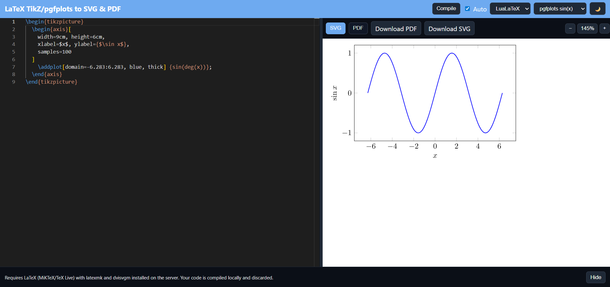

# LaTeX to SVG & PDF Compiler 

A simple local tool to compile LaTeX snippets (TikZ, pgfplots, etc.) with live preview and export to SVG and PDF formats.

Available as both a zero-config desktop app (Electron) and a local web server.

## Features

- 🖥️ Desktop app (zero-config, no separate server needed)
- 🔄 Side-by-side editor (with Monaco) and live preview
- ⚙️ Multiple LaTeX engines: LuaLaTeX, XeLaTeX, pdfLaTeX
- 📦 Automatic document wrapping for standalone snippets
- 📄 Export to both SVG and PDF formats
- 🌐 Alternative web server mode for browser-based usage



## Installation

### Option 1: Desktop App

1. Download the installer from the [Releases page](https://github.com/SamMed05/LaTeX-to-SVG-compiler/releases)
2. Run the installer - No additional setup required!

Or build from source (see [Development](#development) section below).

### Option 2: Web Server Mode

1. **Clone the repository**

   ```bash
   git clone https://github.com/SamMed05/LaTeX-to-SVG-compiler.git
   cd LaTeX-to-SVG-compiler
   ```

2. **Install dependencies**

   ```bash
   npm install
   ```

3. **Start the server**

   ```bash
   npm start
   ```

4. **Open your browser** to <http://localhost:3000>

## Requirements

Both installation modes require a LaTeX distribution and supporting tools:

- **LaTeX distribution**: MiKTeX (Windows) or TeX Live (cross-platform)
- **Required tools in PATH**:
  - `latexmk` - LaTeX build automation
  - LaTeX engines: `lualatex`, `xelatex`, or `pdflatex`
  - `dvisvgm` - DVI to SVG conversion
  - **Ghostscript** (`gswin64c` on Windows) - PDF processing
- **Node.js 18+** (only required when building from source)

If MiKTeX prompts for package installation the first time, allow it. If `dvisvgm` complains about Ghostscript, install it and ensure `gswin64c.exe` is on PATH.

## Development

### Running from source

1. **Install dependencies**

   ```bash
   npm install
   ```

2. **Launch the desktop app (development mode)**

   ```bash
   npm run electron:dev
   ```

### Building Desktop App for Windows (installer + portable artifact)

   ```bash
   npm run electron:build
   ```

   This produces both the NSIS installer and the portable EXE in the `dist/` folder, for example:

   - `dist\LaTeX-to-SVG-<version>-win-x64-setup.exe` (installer)
   - `dist\LaTeX-to-SVG-<version>-win-x64-portable.exe` (portable)

### Icons

Icons are generated automatically during build. To regenerate manually:

```bash
npm run icons
```

The app uses icons generated from `public/favicon.svg`. The window/taskbar icon is also generated from this file.

### Monaco Editor

Monaco is bundled locally under `public/monaco` and loads from `./monaco`. To update Monaco:

1. Copy files from `node_modules/monaco-editor/min` to `public/monaco`
2. Commit the updated files or add a build script

## Troubleshooting

### LaTeX commands not found (`latexmk`, `lualatex`, etc.)

- Ensure your LaTeX distribution added its bin folders to PATH
- On Windows: Restart your command prompt/terminal after LaTeX installation
- Test with: `latexmk --version` and `lualatex --version`

### Ghostscript not found (`gswin64c` not found)

- Install Ghostscript from <https://www.ghostscript.com/download/gsdnld.html>
- Ensure `gswin64c.exe` (Windows) is in PATH
- Test with: `gswin64c --version` (Windows)

### MiKTeX package installation prompts

- Allow automatic package installation in MiKTeX Console
- Or pre-install common packages: `tikz`, `pgfplots`, `xcolor`, `geometry`
- Run: `miktex packages install tikz pgfplots xcolor geometry`

### SVG output is blank or malformed

- Check LaTeX compilation errors in the app console
- Verify `dvisvgm` is installed: `dvisvgm --version`
- Some complex TikZ drawings may require specific packages

## License

[MIT License](LICENSE).
